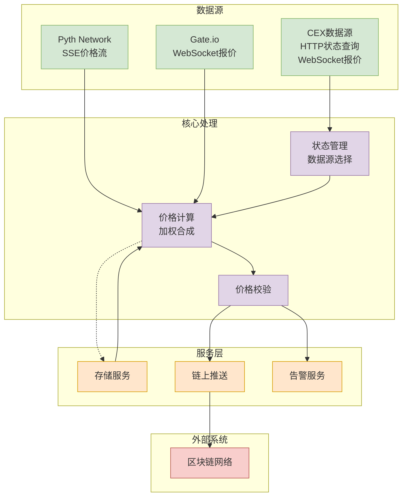
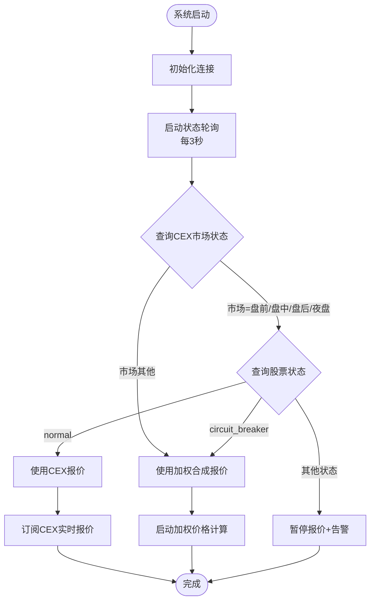
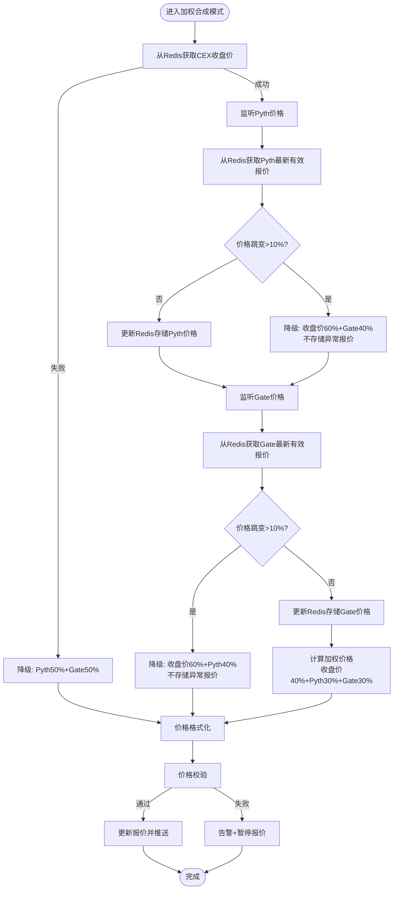
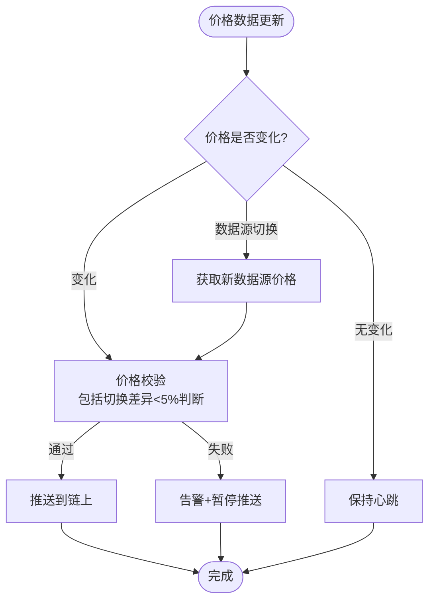
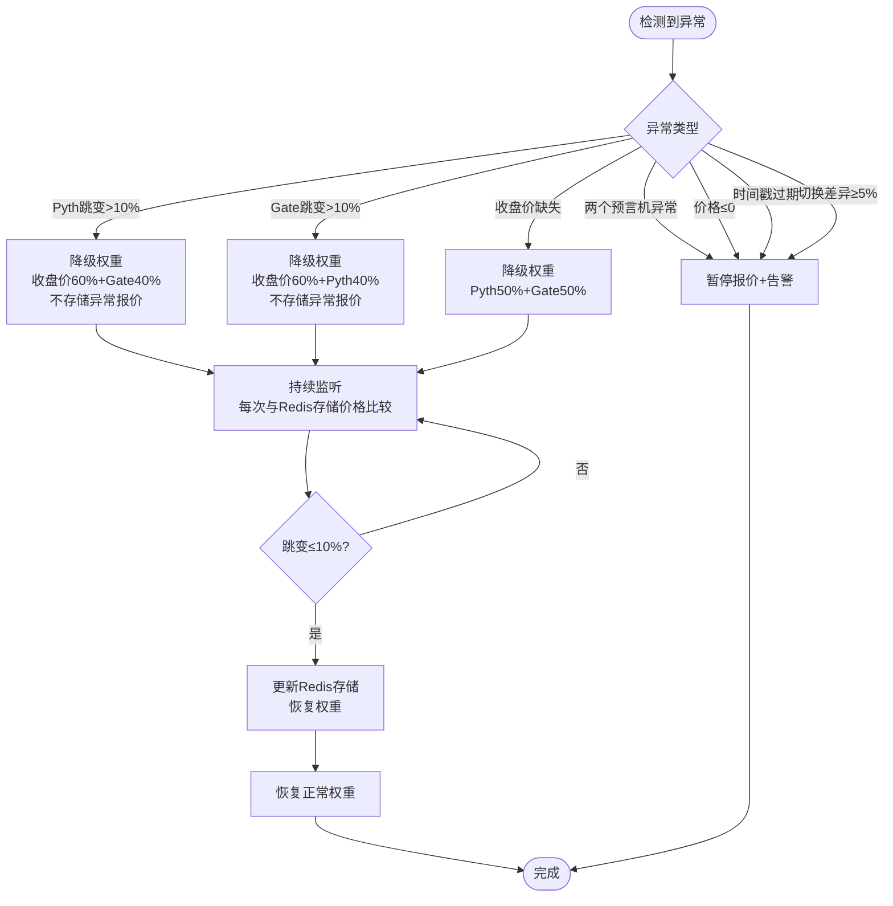

# 股票代币报价系统技术方案文档

> 技术负责人：Daniel | 版本：V2.0 | 日期：2026 年 1 月

---

## 一、系统架构

### 1.1 整体架构图



### 1.2 核心模块说明

**数据源层：**

- **CEX 数据源**：HTTP 查询市场/股票状态（3 秒轮询），WebSocket 订阅实时报价
- **Pyth Network**：SSE 实时价格流
- **Gate.io**：WebSocket 实时报价推送

**核心处理层：**

- **状态管理模块**：根据 CEX 市场/股票状态决定使用 CEX 报价或加权合成报价
- **价格计算模块**：计算加权合成价格（CEX 收盘价 40% + Pyth30% + Gate30%）
- **价格校验模块**：校验价格有效性（>0、时间戳<5 分钟、切换差异<5%）

**服务层：**

- **存储服务**：存储收盘价和最新有效报价
- **链上推送服务**：推送价格更新到区块链
- **告警服务**：发送 Lark 群通知

---

## 二、业务流程

### 2.1 数据源选择流程



**收盘价获取（切换到加权时）**：从缓存的“最后一条 CEX WS 推送”按 marketStatus 取值后写入 Redis——PreMarket/AfterHours 用 `bid_price`，Regular 用 `latest_price`，OverNight 用 `bule_price`。

### 2.2 加权合成报价流程



### 2.3 价格推送流程



**说明**：数据源切换后，从新数据源获取的价格同样需要经过完整的价格校验流程（包括切换差异<5%的判断）。只有当校验通过时才能推送，如果切换差异 ≥5%，则暂停报价并告警。

### 2.4 异常处理流程



---

## 三、技术栈

### 3.1 编程语言

- **Go 1.21+**：高性能、并发友好

### 3.2 数据源接入

- **CEX**：`net/http` (HTTP) + `github.com/gorilla/websocket` (WebSocket)
- **Pyth**：`net/http` + `bufio.Scanner` (SSE)
- **Gate.io**：`github.com/gorilla/websocket` (WebSocket)

### 3.3 存储

- **Redis**：高性能内存数据库，支持持久化
- **库**：`github.com/redis/go-redis/v9`
- **存储策略**：
  - CEX 收盘价快照（在从 CEX 切换到加权合成时生成）：保留一周，使用 TTL 自动过期
  - Pyth/Gate 最新报价：覆盖更新，只保留最新一条
  - 异常报价不存储，用于跳变判断和降权恢复

### 3.4 链上交互

- 根据具体链的 SDK 实现（如 Cosmos SDK、Ethereum 等）

### 3.5 告警

- **Lark Webhook**：`net/http` 发送告警通知

---

## 四、接口设计

### 4.1 CEX 数据源接口

#### 4.1.1 市场状态接口

- **协议**：HTTP GET
- **端点**：`/api/v1/market/status`
- **频率**：3 秒轮询
- **响应**：`{status: "trading", timestamp: 1704067200}`

#### 4.1.2 股票状态接口

- **协议**：HTTP GET
- **端点**：`/api/v1/stock/status?symbol=AAPLX`
- **频率**：3 秒轮询
- **响应**：`{symbol: "AAPLX", status: "normal", timestamp: 1704067200}`

#### 4.1.3 实时报价推送

- **协议**：WebSocket
- **端点**：`wss://cex-api/ws`
- **订阅**：`{channel: "spot.tickers", event: "subscribe", payload: ["AAPLX_USDT"]}`

### 4.2 Pyth Network 接口

- **协议**：SSE
- **端点**：`https://hermes.pyth.network/v2/updates/price/feed_ids?ids[]={feed_id}`
- **Feed ID**：
  - AAPLX: `978e6cc68a119ce066aa830017318563a9ed04ec3a0a6439010fc11296a58675`
  - NVDAX: `4244d07890e4610f46bbde67de8f43a4bf8b569eebe904f136b469f148503b7f`
  - TSLAX: `47a156470288850a440df3a6ce85a55917b813a19bb5b31128a33a986566a362`

### 4.3 Gate.io 接口

- **协议**：WebSocket
- **端点**：`wss://api.gateio.ws/ws/v4/`
- **订阅**：`{channel: "spot.tickers", event: "subscribe", payload: ["AAPLX_USDT"]}`

---

## 五、模块设计

### 5.1 状态管理模块

**职责**：每 3 秒查询 CEX 市场/股票状态，决定数据源选择

**接口**：

```go
type StateManager interface {
    GetCurrentDataSource(symbol string) DataSource
    Start()
}
```

**逻辑**：

- 当市场状态 ∈ {pre_hour_trading, trading, post_hour_trading, overnight} 且股票状态 = normal 时，使用 CEX 报价
- 当市场状态 ∈ {pre_hour_trading, trading, post_hour_trading, overnight} 且股票状态 = circuit_breaker 时，使用加权合成报价
- 当市场状态 ∈ {pre_hour_trading, trading, post_hour_trading, overnight} 且股票状态 为其他值时，暂停报价并告警
- 当市场状态 为其他值（非盘前/盘中/盘后/夜盘）且股票状态 ∈ {normal, circuit_breaker} 时，使用加权合成报价
- 当市场状态 为其他值且股票状态 为其他值时，暂停报价并告警

### 5.2 价格计算模块

**职责**：计算加权合成价格，处理价格跳变和降权逻辑

**接口**：

```go
type PriceCalculator interface {
    CalculateWeightedPrice(symbol string) (float64, error)
    CheckPriceJump(symbol, source string, currentPrice float64) (bool, error)
}
```

**价格跳变判断**：

- 获取存储的最新有效报价
- 计算跳变：`|(当前价格 - 存储价格) / 存储价格| × 100%`
- 跳变 ≤ 10%：正常，更新存储，使用正常权重
- 跳变 > 10%：异常，不存储，数据源降权，持续监听直到恢复

**权重规则**：

- 正常：收盘价 40% + Pyth30% + Gate30%
- Pyth 异常（跳变>10%）：收盘价 60% + Gate40%
- Gate 异常（跳变>10%）：收盘价 60% + Pyth40%
- 收盘价异常：Pyth50% + Gate50%

**价格格式化**：

- price < 1：保留 4 位小数（舍位）
- price ≥ 1：保留 2 位小数（舍位）

### 5.3 价格校验模块

**职责**：校验价格有效性

**接口**：

```go
type PriceValidator interface {
    Validate(price float64, timestamp int64, lastPrice float64) error
}
```

**校验规则**：

- 价格 > 0
- 时间戳与系统时间相差 < 5 分钟
- 切换价格差异 < 5%

### 5.4 存储模块

**职责**：使用 Redis 存储收盘价和最新有效报价

**接口**：

```go
type Storage interface {
    // 收盘价存储（保留一周）
    GetClosePrice(symbol string, timestamp int64) (float64, error)
    SetClosePrice(symbol string, timestamp int64, price float64) error

    // Pyth/Gate最新有效报价（覆盖更新，只保留最新一条）
    GetLastValidPrice(symbol, source string) (float64, int64, error)
    SetLastValidPrice(symbol, source string, price float64, timestamp int64) error

    // 检查价格跳变并更新存储
    CheckAndUpdatePrice(symbol, source string, currentPrice float64, timestamp int64) (bool, error)
}
```

**存储策略**：

- **收盘价**：
  - Key 格式：`close_price:{symbol}:{timestamp}`（如 `close_price:AAPLX:1704067200000`）
  - timestamp：从 WebSocket 返回结果中获取的时间戳（毫秒）
  - TTL：7 天，自动过期
  - 在从 CEX 切换到加权合成报价时写入；同一交易日内可能多次覆盖，没有发生切换则当日可能没有收盘价记录
- **收盘价获取时机与来源**（切换到加权时执行）：
  - 读取缓存的最后一条 CEX WS 推送，根据 `marketStatus` 取对应字段：
    - PreMarket / AfterHours：`bid_price`
    - Regular：`latest_price`
    - OverNight：`bule_price`
  - 写入 Redis 作为收盘价基准
- **Pyth/Gate 最新报价**：
  - Key 格式：`last_price:{symbol}:{source}`（如 `last_price:AAPLX:pyth`）
  - 覆盖更新，只保留最新一条
  - 用于跳变判断（>10%）

**价格跳变判断逻辑**：

1. 获取存储的最新有效报价
2. 计算跳变：`|(当前价格 - 存储价格) / 存储价格| × 100%`
3. 如果跳变 ≤ 10%：

- 更新存储为当前价格
- 数据源正常，使用正常权重

4. 如果跳变 > 10%：

- **不存储**异常报价
- 数据源降权
- 后续每次报价都与存储的价格比较
- 直到有一次价格正常（跳变 ≤ 10%），才恢复存储并恢复权重

### 5.5 链上推送模块

**职责**：推送价格更新到链上

**接口**：

```go
type OnChainPusher interface {
    PushPrice(symbol string, price float64) error
}
```

**推送规则**：

- 仅价格变化时推送（价格变化且通过校验）
- 数据源切换后，从新数据源获取的价格同样需要经过价格校验流程（包括切换差异<5%的判断），校验通过后才能推送；如果切换差异 ≥5%，则暂停报价并告警

### 5.6 告警模块

**职责**：发送 Lark 群通知

**接口**：

```go
type AlertManager interface {
    SendAlert(alertType AlertType, symbol string, details ...string)
}
```

**告警触发条件**：

- 价格 ≤ 0
- 时间戳过期 (>5 分钟)
- 切换价格差异 ≥ 5%
- 两个预言机都异常
- 连接断开且重连失败

---

## 六、业务规则

### 6.1 数据源选择规则

| 市场状态                                             | 股票状态        | 使用数据源/处理 |
| ---------------------------------------------------- | --------------- | --------------- |
| pre_hour_trading/trading/post_hour_trading/overnight | normal          | CEX 报价        |
| pre_hour_trading/trading/post_hour_trading/overnight | circuit_breaker | 加权合成报价    |
| pre_hour_trading/trading/post_hour_trading/overnight | 其他            | 暂停报价 + 告警 |
| 其他                                                 | normal/熔断     | 加权合成报价    |
| 其他                                                 | 其他            | 暂停报价 + 告警 |

### 6.2 加权合成报价规则

**正常权重**：

- CEX 收盘价：40%
- Pyth 价格：30%
- Gate 价格：30%

**降级权重**：

- Pyth 异常：收盘价 60% + Gate40%
- Gate 异常：收盘价 60% + Pyth40%
- 收盘价异常：Pyth50% + Gate50%
- 两个预言机都异常：暂停报价 + 告警

### 6.3 价格校验规则

| 校验项   | 规则                    | 失败处理                  |
| -------- | ----------------------- | ------------------------- |
| 价格范围 | > 0                     | 暂停报价 + 告警           |
| 时间戳   | 与系统时间相差 < 5 分钟 | 暂停报价 + 告警           |
| 切换差异 | < 5%                    | 差异 ≥5%时暂停报价 + 告警 |
| 价格跳变 | < 10%                   | 跳变 ≥10%时使用降级权重   |

### 6.4 价格格式化规则

- **price < 1**：保留 4 位小数（向下舍位）
- **price ≥ 1**：保留 2 位小数（向下舍位）

---

## 七、部署与运维

### 7.1 部署方式

- **容器化**：Docker + Kubernetes（推荐）
- **二进制**：直接运行编译后的二进制文件

### 7.2 配置管理

- **环境变量**：敏感配置（API Key、私钥等）
- **配置文件**：非敏感配置（端点地址、阈值等）

### 7.3 监控指标

- 连接状态（CEX、Pyth、Gate）
- 价格更新频率
- 数据源切换次数
- 异常告警次数
- 链上推送延迟

### 7.4 健康检查

- **HTTP 端点**：`/health`
- **检查项**：数据源连接状态、最新价格更新时间、系统运行时间

---

## 八、开发计划

### 8.1 第一阶段：核心功能（2 周）

- [ ] CEX 数据源对接（HTTP 状态查询、WebSocket 报价）
- [ ] Pyth SSE 客户端实现
- [ ] Gate WebSocket 客户端实现
- [ ] 状态管理模块（3 秒 HTTP 轮询）
- [ ] 基础价格计算模块

### 8.2 第二阶段：高级功能（2 周）

- [ ] 加权合成报价计算
- [ ] 价格校验模块
- [ ] 降级处理模块
- [ ] 告警模块（Lark）
- [ ] 存储模块

### 8.3 第三阶段：链上集成（1 周）

- [ ] 链上推送模块
- [ ] 价格推送逻辑（仅变化时推送）
- [ ] 端到端测试

### 8.4 第四阶段：优化与测试（1 周）

- [ ] 性能优化
- [ ] 异常场景测试
- [ ] 压力测试
- [ ] 文档完善

---

## 九、风险与应对

| 风险               | 影响 | 应对措施                             |
| ------------------ | ---- | ------------------------------------ |
| CEX 接口不稳定     | 高   | 实现重连机制，失败时使用加权合成报价 |
| Pyth/Gate 连接断开 | 中   | 自动重连，异常时使用降级权重         |
| 链上推送失败       | 高   | 重试机制，失败告警                   |
| 价格计算错误       | 高   | 多重校验，异常告警                   |
| 价格差异过大       | 高   | 切换差异 ≥5%时暂停报价               |
| 数据源全部异常     | 高   | 暂停报价 + 告警                      |

---

## 十、附录

### 10.1 支持的股票代币

- AAPLX (Apple)
- NVDAX (Nvidia)
- TSLAX (Tesla)

### 10.2 Feed ID 映射表

| 股票代币 | Pyth Feed ID                                                     |
| -------- | ---------------------------------------------------------------- |
| AAPLX    | 978e6cc68a119ce066aa830017318563a9ed04ec3a0a6439010fc11296a58675 |
| NVDAX    | 4244d07890e4610f46bbde67de8f43a4bf8b569eebe904f136b469f148503b7f |
| TSLAX    | 47a156470288850a440df3a6ce85a55917b813a19bb5b31128a33a986566a362 |

### 10.3 Gate.io 交易对

- AAPLX_USDT
- NVDAX_USDT
- TSLAX_USDT

---

**文档版本历史：**

- V1.0 (2026-01-11): 初始版本
